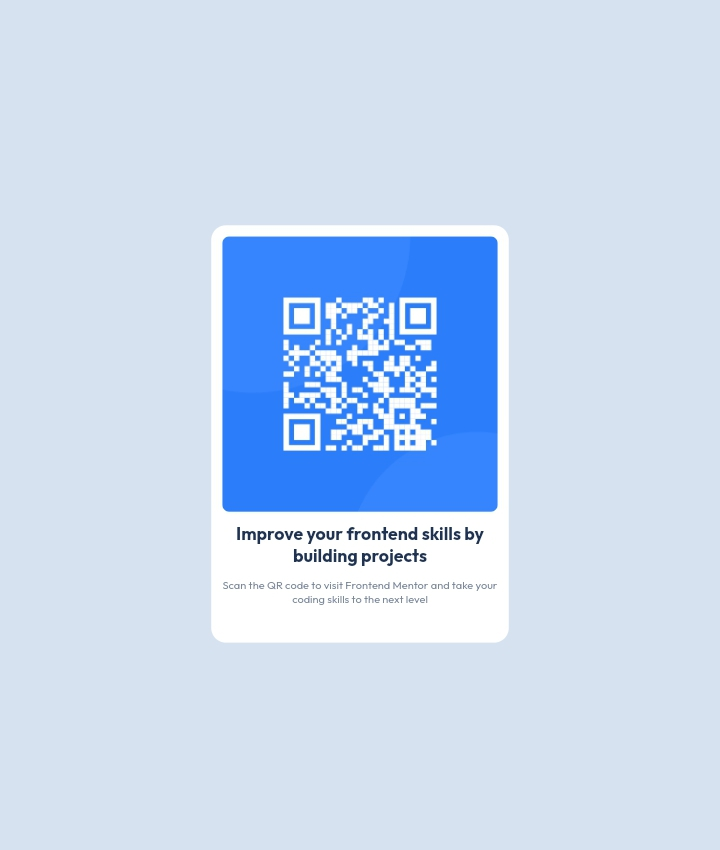

# Frontend Mentor - QR code component solution

This is a solution to the [QR code component challenge on Frontend Mentor](https://www.frontendmentor.io/challenges/qr-code-component-iux_sIO_H). Frontend Mentor challenges help you improve your coding skills by building realistic projects.

## Table of contents

- [Overview](#overview)
  - [Screenshot](#screenshot)
  - [Links](#links)
- [My process](#my-process)
  - [Built with](#built-with)
  - [What I learned](#what-i-learned)
  - [Continued development](#continued-development)
  - [Useful resources](#useful-resources)
- [Author](#author)
- [Acknowledgments](#acknowledgments)

## Overview

### Screenshot




### Links

- Solution URL: [QR Code Solution URL](https://github.com/Tamuno1383482586/qr-code-component-main/)
- Live Site URL: [QR code Live URL](https://tamuno1383482586.github.io/qr-code-component-main/)

## My process

### Built with

- Semantic HTML5 markup
- CSS custom properties
- Flexbox
- Mobile-first workflow
- [Styled Components](https://styled-components.com/) - For styles

### What I learned

How to ceneter a container both in desktop viewport using the below css rule

To see how you can add code snippets, see below:

```
html
```

<div class="container">
      
      <h2>Improve your frontend skills by building projects</h2>
      <p>
        Scan the QR code to visit Frontend Mentor and take your coding skills to
        the next level
      </p>
    </div>
    
```css
@media (min-width: 375px) {
  @media (max-width: 1440px) {
    body {
      display: flex;
      width: 100%;
      height: 100vh;
    }
    .container {
      max-width: 375px;
      margin: auto;
    }
    /*.container {
    position: relative;
    left: 300px;
    top: 300px;
    
  }*/
  }
}

```


### Continued development

I will like to improve in the use of Css layouts and the flexbox container

### Useful resources

- [Example resource 1](https://www.cdnfonts.com/outfit.font) - This helped me in adding
the external font 'Outfit' font-family
- [Example resource 2](https://docs.github.com/en/get-started/quickstart/create-a-repo?tool=cli) - This is an amazing article
which helped me finally understand how to get started with github CLI for
repository creating,commit and pushing.


## Author

- Website - [Tamuno Divine]
- Frontend Mentor - [@Tamuno1383482586](https://www.frontendmentor.io/profile/Tamuno1383482586)
- Twitter - [@DivineTamuno](https://mobile.twitter.com/DivineTamuno)


## Acknowledgments

In future projects i would like to collaborate with team members but this
project was single handely completed by me

```
